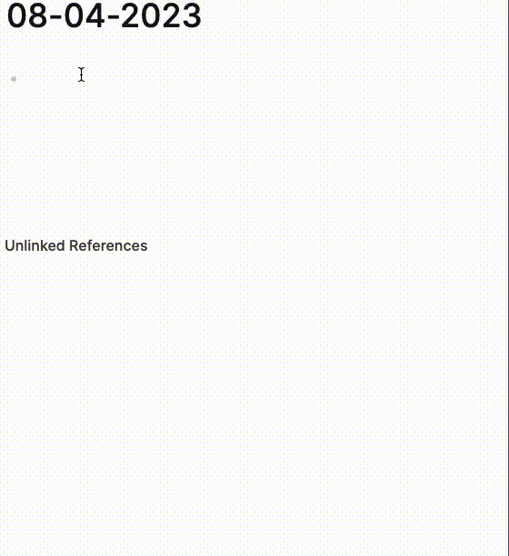

[:gift_heart: Sponsor this project on Github](https://github.com/sponsors/hkgnp) or [:coffee: Get me a coffee](https://www.buymeacoffee.com/hkgnp.dev) if you like this plugin!

# Overview

This plugin looks for coordinates or Google Maps links on your page and plots them as markers on a map. You may use it to journal an event, or record down something memorable that happened there.




# Usage

## Step 1

Decide on a centerpoint where your markers are likely to be around, and the type of map that you would like to draw. After doing so, start by typing `/Add map` to trigger the below renderer. Depending on the centerpoint and the type of map, you can make changes to the flags. Some examples can be found below:

```
{{renderer :map_hkuudwvv, default, Singapore}} [:div {:is "map-hkuudwvv"}]

{{renderer :map_hkuudwvv, cycling, Tokyo}} [:div {:is "map-hkuudwvv"}]

{{renderer :map_hkuudwvv, hiking, San Francisco}} [:div {:is "map-hkuudwvv"}]
```

## Step 2

A map will be drawn on the page. You can then continue to create markers. The plugin looks for block properties `coords` and `waypoint`, where the latter is for creating routes (see below). For `coords`, you can either enter the latitude and longitude of the place in the formats below, or simply attach a Google Maps link. Clicking on the marker will bring you to the corresponding block.

An example of such a block would be:

```
Jurong Bird Park
coords:: 1.3187° N, 103.7064° E

Jurong Bird Park
coords:: 1.3187, 103.7064

Jurong Bird Park
coords:: https://www.google.com/maps/place/Jurong+Bird+Park/@1.3190699,103.7043014,17z
```

## Step 2A: Using Queries

You can also use queries to create markers. Simply add in the following below the map and click the `Refresh` button.

```
{{query (property :tags "france trip")}}
```

## Step 2B: Right-clicking on Map

When right-clicking on the map, you can automatically create a marker, and a new block will be inserted on the page with the coordinates you just created. You can simply add in the name of the location and click the `Refresh` button to update your marker.

## Step 2C: Search Locations

Use `/Get coordinates from location` and key in the location that you would like to search for. Be as specific as possible. Press `Enter` and your location will be added as a block.

## Step 3

When finished, click `Refresh` on the top right hand corner of the map, and your markers will be placed on it.

## Step 4

If you want to include routing instructions, you can add a `waypoint` property. First stop would be `waypoint:: 1`, second stop would be `waypoint:: 2` and so on. See below for an example:

```
Jurong Bird Park
coords:: 1.3187° N, 103.7064° E
waypoint:: 1

Changi Airport
coords:: 1.3644° N, 103.9915° E
waypoint:: 2
```

Click on `Refresh` on the top right hand corner of the map to display the routing instructions.

# API keys

### Mapbox:

Mapbox API keys are for obtaining the cycling and walking directions. Go to [their website](https://www.mapbox.com/) and sign up for a free account. Create a new access token and note down the generated Access Token somewhere.

### Thunderforest:

Thunderforest API keys are for providing cycling and hiking maps. Go to [their website](https://www.thunderforest.com/) and sign up for a free account. Upon logging in, your API key is immediately available.

# Important Notes

Please note the following when using this plugin:

1. If you search by address, please try to be as specific as possible. A general search query will likely not return an accurate result.
2. I have not tested all permutations, so if your search query is obscure, there may be no results.
3. Routing function (directinos and maps) uses your Mapbox and Thunderforest APIs. Excessive usage may exceed the free usage so **please proceed with caution**.

# Installation

Manual installation for now if you cannot find it in the marketplace.

1. Download the latest release.
2. Unzip it to anywhere of your choice.
3. Manually load the plugin from Logseq.

# Credits

- Darwis for his idea on this implementation approach and his guidance.
- [Open Street Maps](https://www.openstreetmap.org/copyright) for without them, this plugin would not have been possible since mapping is so damn difficult.
- [Leaflet](https://www.leafletjs.com) for their excellent mapping API.
- [Leaflet Routing Machine](https://github.com/perliedman/leaflet-routing-machine) for providing the routing mechanism.
- [Mapbox](https://www.mapbox.com) for their excellent directions system.
- [Thunderforest](https://www.thunderforest.com) for their beautiful cycling and hiking maps. They offer other types of maps too!
